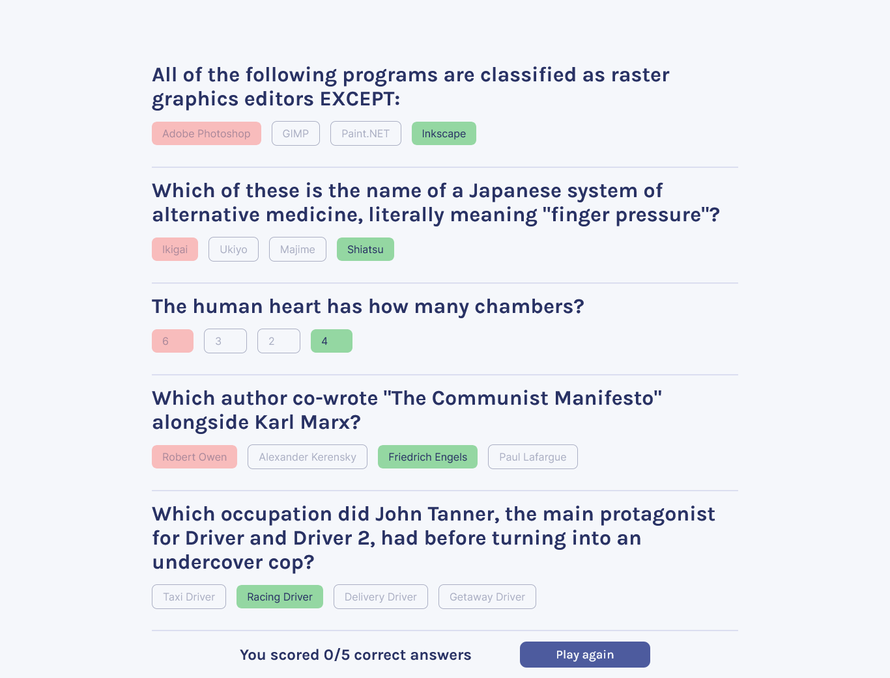

<!-- # Quizzical

Quiz app with React and API

<!-- https://quiz-app5.netlify.app

[API link](https://opentdb.com/) -->

<div align="center">
<h2>React-Quiz App</h2>


</div>

## Introduction

Quiz App built with [React](https://reactjs.org/), [Open Trivia DB](https://opentdb.com/) and [TailwindCSS](https://tailwindcss.com/).



# Live Demo

You can Check demo here [here](https://quiz-app5.netlify.app)

## Installation

- Install dependencies

```
$ npm install
```

- Run it

```
$ npm start
```
